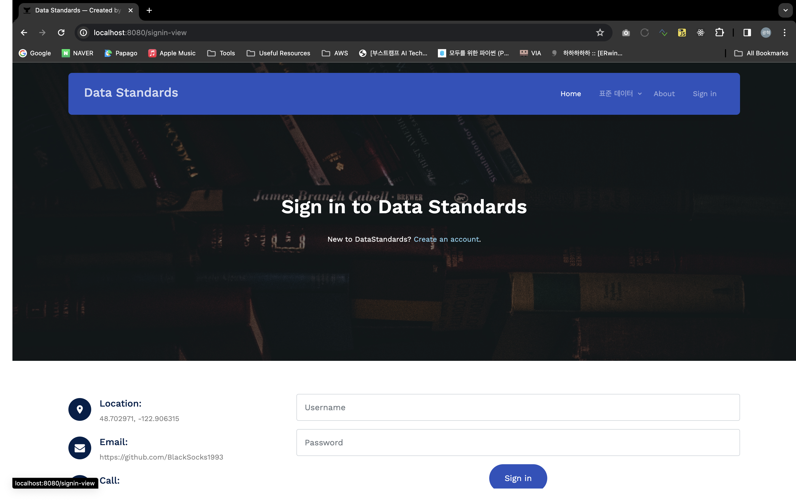

## Hi there 👋
Spring Boot, Security 공부 및 사이드 프로젝트를 목적으로 개발

- 데이터 표준관리

## Tech Stack
- Backend: Java (17), Spring Boot, Hibernate, Restful Services, Microservices
- Frontend: HTML5, CSS3, JavaScript, Jquery, Thymeleaf
- Database: H2, PostgreSQL
- Build tools: Gradle
- Version Control: Git
- IDE: IntelliJ IDEA, VS Code
- Operating System: Linux, Mac, Windows

## Demo

  
    

  
    

    

